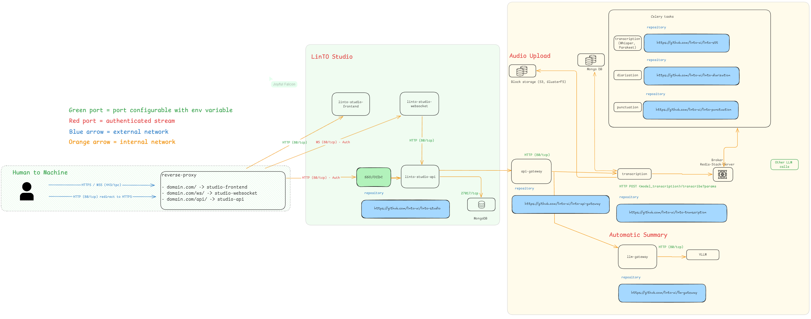

# Architecture

## Légende détaillée

### LinTo Studio

https://github.com/linto-ai/linto-studio

Solution open source de gestion de l'enregistrement, de la transcription et des médias, alimentée par l'IA.

#### Composants :

**linto-studio-frontend**
Interface web principale pour LinTO Studio.
Docker build disponible.
https://github.com/linto-ai/linto-studio/tree/master/studio-frontend

**linto-studio-websocket**
Serveur websocket pour les échanges.
Docker build disponible.
https://github.com/linto-ai/linto-studio/tree/master/studio-websocket

**linto-studio-api**
Serveur backend de LinTO Studio.
Docker build disponible.
https://github.com/linto-ai/linto-studio/tree/master/studio-api

#### MongoDB

Conteneur MongoDB SGBD.

### API-Gateway

Proxy pour les services. Supporte l'usage de middlewares divers (facturation, métriques d'usage...)

Docker build disponible : api-gateway

https://github.com/linto-ai/linto-api-gateway

### Transcription

Le service de transcription est l'API pour demander des transcriptions. Il permet de préparer, séquencer et paralléliser les tâches fournies aux services utilisant l'IA.

Docker build disponible : transcription_service

https://github.com/linto-ai/linto-transcription

### STT

LinTO-STT est une API pour la reconnaissance automatique de la parole (ASR). Cette API prend en charge des tâches fournies par le service de transcription et utilise des GPU.
Elle peut être utilisée pour des transcriptions hors ligne ou en temps réel.
Actuellement, elle prend en charge 2 familles de modèles STT : Kaldi et Whisper.

Docker builds disponibles : linto-stt-whisper, linto-stt-kaldi

https://github.com/linto-ai/linto-stt

### Diarisation

LinTO-diarization est une API pour la diarisation des locuteurs (segmenter un flux audio en segments homogènes selon l'identité du locuteur), avec certaines capacités d'identification des locuteurs lorsque des échantillons audio de locuteurs connus sont fournis. Cette API prend en charge des tâches fournies par le service de transcription et utilise des GPU.

Docker builds disponibles : linto-diarization-pyannote, linto-diarization-simple

https://github.com/linto-ai/linto-diarization